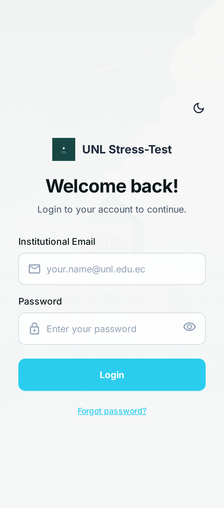
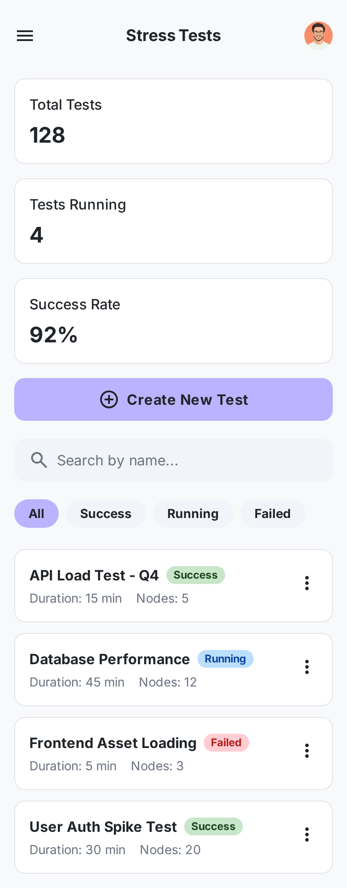
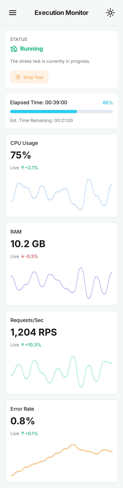
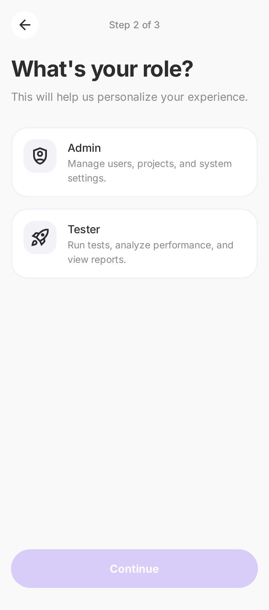

# Prototipo HTML/CSS basado en Stitch – Documentación UI

Este documento describe el flujo y estructura de las 8 pantallas implementadas en HTML5/CSS3 a partir del prototipo creado en Stitch.  
Incluye el propósito de cada pantalla, sus componentes principales y las capturas de pantalla correspondientes.

---

## 🧭 Flujo general del prototipo

El prototipo representa el flujo completo de un sistema de **gestión de pruebas de estrés**:

1. **Login del usuario (docente/administrador)**  
2. **Pantalla principal o dashboard**  
3. **Listado general de pruebas de estrés**  
4. **Crear una nueva prueba de estrés**  
5. **Monitorear la ejecución de una prueba**  
6. **Ver métricas y resultados**  
7. **Configurar preferencias del usuario**  
8. **Seleccionar el rol y tipo de usuario**

Cada pantalla sigue una estructura semántica basada en `<header>`, `<nav>`, `<main>` y `<section>`, con diseño responsivo básico mediante Flexbox y ajuste para pantallas móviles.

---

# 📌 1. Login View

**Propósito:**  
Permitir que el usuario ingrese con su correo institucional y contraseña.

**Componentes principales:**  
- Formulario de acceso  
- Campos: correo y contraseña  
- Botón “Iniciar sesión”  
- Pie de página con información institucional  

**Captura:**  

---

# 📌 2. Home Dashboard

**Propósito:**  
Mostrar una vista general del sistema: accesos rápidos, información resumida y navegación.

**Componentes principales:**  
- Barra lateral (menú)  
- Tarjetas con métricas o accesos  
- Secciones resumen  

**Captura:**  

---

# 📌 3. Stress Test List

**Propósito:**  
Listar todas las pruebas de estrés creadas en el sistema.

**Componentes principales:**  
- Tabla o lista de pruebas  
- Botones: ver, editar, ejecutar, eliminar  
- Botón “Crear nueva prueba”  

**Captura:**  

---

# 📌 4. Create New Stress Test

**Propósito:**  
Permitir configurar una nueva prueba de estrés desde cero.

**Componentes principales:**  
- Formulario con parámetros de carga  
- Selectores, entradas numéricas  
- Botón “Guardar / Crear prueba”  

**Captura:**  

---

# 📌 5. Execution Monitor View

**Propósito:**  
Monitorear en tiempo real la ejecución de una prueba.

**Componentes principales:**  
- Indicadores de progreso  
- Métricas en vivo  
- Gráficos o barras de estado  
- Botón “Detener ejecución”  

**Captura:**  

---

# 📌 6. Analytics & Results View

**Propósito:**  
Mostrar resultados obtenidos: gráficos, análisis y estadísticas.

**Componentes principales:**  
- Gráficas de rendimiento  
- Resumen de resultados  
- Descarga de informes  

**Captura:**  

---

# 📌 7. User Onboarding – Preferences

**Propósito:**  
Permitir que el usuario configure sus preferencias del sistema.

**Componentes principales:**  
- Toggles, selects, radios  
- Preferencias visuales  
- Configuración de notificaciones  

**Captura:**  

---

# 📌 8. User Onboarding – Role

**Propósito:**  
Definir el tipo de usuario según su rol institucional.

**Componentes principales:**  
- Selección de rol  
- Textos explicativos  
- Botón continuar  

**Captura:**  

---

# ✔ Conclusión

El prototipo HTML/CSS basado en Stitch permitió:

- Mantener una estructura semántica clara y accesible  
- Implementar diseño responsivo desde el inicio  
- Tener un flujo visual ordenado para futuras mejoras  
- Facilitar la transición hacia el frontend definitivo  

---

# 🏷 Carpeta de imágenes

Todas las capturas utilizadas se encuentran en:  
`frontend/prototipos/ui-stitch/<pantalla>/screen.png`

